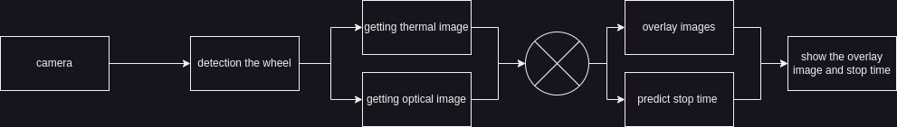

### Пайплайн

1. Получение изображения с камеры: Система получает видео или статичные изображения, которые содержат колесо, с камеры.
2. Детекция колеса: Выполняется обнаружение области изображения, содержащей колесо, с помощью алгоритмов детекции объектов с помощью YOLO/ssd mobile
3. Получение термального изображения: Выделяется термальная информация (например, с инфракрасного сенсора) из захваченного изображения.
4. Получение оптического изображения: Извлекается видимый спектр изображения для анализа оптической информации.
5. Наложение изображений: Термальное и оптическое изображения объединяются, чтобы получить совмещенное представление, отображающее детали из обоих типов данных.
6. Предсказание времени остановки: Используя совмещенные данные, модель машинного обучения предсказывает, через сколько времени колесо остановится.
7. Отображение результата: Показывается наложенное изображение и предсказанное время остановки на интерфейсе.

### Датасет
- [Ноутбук создание датасета](./dataset.ipynb) - создание датасета из видео, берет фотографии из видео и сохраняет вместе с временем от начала, фотография берется в рандомный промежуток от 1 до 10
- [Ссылка на датасет](https://www.kaggle.com/datasets/idwntl/elapsed-thermal-wheel)

### Модель
Мы попробовали две модели, которая базируется на VGG16 и на resnet, resnet обучалась быстрее, а так же выдавала лучше метрики  
- [Обучение и инферес модели](./thermal-wheel-time.ipynb)
- Архитектура  

### Наложение фото и детекция 
Мы попробовали два метода, первый подразумевает использование метода ключевых точек, а так же наложение фото с помощью матрицы смещение, метод матрицы смещения показал себя лучше
Детекция мы реализовали с помощью YOLO, но сейчас обучаем ssd mobile
- [Детекция и наложение фото при помощи ключевых точек](./Overlay.ipynb)
- [Наложение при помощи FOV](./FOVANALIZ.ipynb)